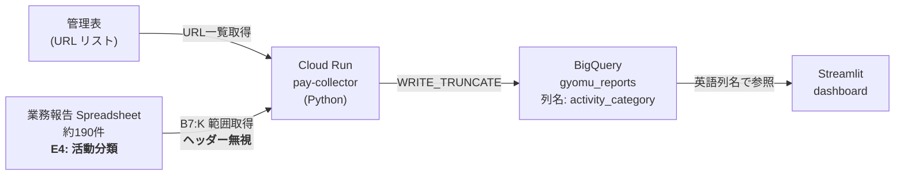
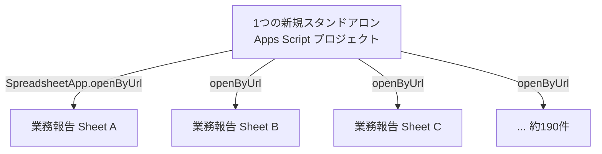
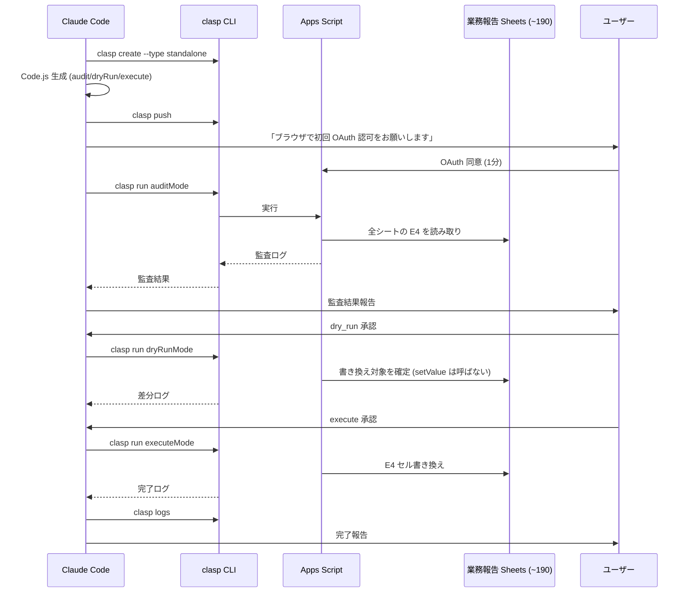

## 1. 概要と背景

| 項目 | 内容 |
|------|------|
| 目的 | 業務報告スプレッドシート (約190件) のヘッダー「活動分類」を別名に一括変更したい |
| 対象範囲 | `【都度入力】業務報告` タブの `E4` セル（ヘッダー文字列のみ） |
| 変更しないもの | 列位置・列数・データ値（プルダウンの選択肢）・シート構造 |
| 結論 | **システム影響ゼロで安全に実施可能** |

## 2. システム全体像と対象セル

### 2.1 データパイプライン

**重要**: collector は `B{start_row}:K` の**範囲ベース**でデータを取得し、ヘッダー文字列は一切参照しない。業務報告タブは `data_start_row = 7` のためヘッダー行（4行目）は読み取り範囲外。

### 2.2 対象セルの位置

| 行 | A | B | C | D | E | F | G | H | I | J | K |
|---|---|---|---|---|---|---|---|---|---|---|---|
| 4 (ヘッダー) | ― | 年 | 月日 | 曜日 | **活動分類** | 業務分類 | スポンサー | 内容 | 業務単価 | 所要時間 | 金額 |
| 5〜6 | (記入例: collector 読み取り範囲外) | | | | | | | | | | |
| 7〜 | (データ行: collector 取り込み対象) | | | | | | | | | | |

→ **書き換え対象は `E4` セルのみ**。

## 3. 影響分析 ― 各レイヤーへの影響

| レイヤー | 参照方式 | 影響 | 論拠 |
|---------|---------|------|------|
| Cloud Run collector | 範囲ベース `B7:K` | **なし** | ヘッダー行は読み取り範囲外。`grep "活動分類" cloud-run/` で 0 ヒット |
| BigQuery スキーマ | 英語識別子 | **なし** | `activity_category` 列名で固定。日本語はコメントのみ |
| BigQuery VIEW | 英語識別子 | **なし** | `v_gyomu_enriched` 等は英語列名で参照 |
| Streamlit dashboard | 英語列名 → 日本語表示 | **なし** | UI 表示の「活動分類」はコード内文字列で、シートのヘッダー値とは独立 |
| 旧 GAS (`コード.js`) | 位置ベース | **なし** | 稼働停止中。`getRange` で位置参照、ヘッダー文字列なし |
| シート内ワークシート関数 | ― | **なし** | テンプレ通り使用、ヘッダー名参照の数式なし |
| 業務報告シートのバインド GAS | ― | **なし** | 把握範囲で未使用 |

**結論**: ヘッダー「活動分類」を別名に変えても、システム動作・データ・集計のいずれにも影響しない。

## 4. 実装アプローチ ― なぜ「一時利用 GAS + clasp」か

### 4.1 GAS の使い方

各シートに紐づくバインド GAS は**触らない**。1 つのスタンドアロン GAS から全シートを巡回・編集する。

### 4.2 ツール選定の比較

| 手段 | 認証 | 実装コスト | 後始末 | 判定 |
|------|------|----------|-------|------|
| **スタンドアロン GAS** | 実行者の Google アカウント 1 回 OAuth | 低（数十行） | プロジェクト削除でクリーン | ★★★ 最適 |
| Python + Sheets API (ローカル) | OAuth クライアント作成 or DWD 設定 | 中 | ローカル設定が残る | ★★ |
| Python + DWD (collector 認証流用) | 本番 SA にスコープ追加必須 | 高 | 本番認証構成を改変 | ★ 本番リスク |
| Playwright MCP（ブラウザ自動化） | ― | 高（OAuth 多段ダイアログ + Apps Script UI 頻繁変更で selector が脆い） | ― | ✗ |
| 手作業 | ― | 高（190回 × 数秒） | ― | ✗ |

## 5. 実行フロー（3段階モデル）

### 3段階の役割

| モード | 処理内容 | 目的 |
|-------|---------|------|
| `audit` | 全シートの E4 現在値、タブ存在、権限を **読み取り専用** で確認 | 実態把握 / 想定外のシート検出 |
| `dry_run` | 書き換え対象を確定するが `setValue` は呼ばない | 旧値 → 新値の差分確認 |
| `execute` | 実書き換え + 旧値/新値ログ | 本番反映 |

## 6. リスクと対策

| リスク | 対策 |
|------|------|
| E4 セルが「活動分類」以外（メンバー改変） | 現在値検証してから書き換え。想定外はスキップ + ログ |
| 保護範囲で setValue 失敗 | try/catch でエラー記録、個別対応 |
| 結合セル | `getMergedRanges()` で事前検出 |
| シートタブ名違い | `getSheetByName()` null なら skip + ログ |
| 編集権限なし | try/catch で記録 |
| 誤書き換え時のロールバック | 事前に旧値ログ必須 + dry_run で差分確認 |
| Apps Script 6 分タイムアウト | 進捗を PropertiesService に保存して再実行可能化、または分割実行 |

## 7. 後始末

| 項目 | 処理 |
|------|------|
| Apps Script プロジェクト | execute 後に Drive で削除 or アーカイブ |
| ローカル clasp 設定 | `.clasp.json` 等を削除 |
| システム恒久資産 | **残さない**（本作業はスポット対応） |
| ドキュメント更新 | dashboard ヘルプ / SOW / スクショ等の「活動分類」を新名に統一（別タスク） |
