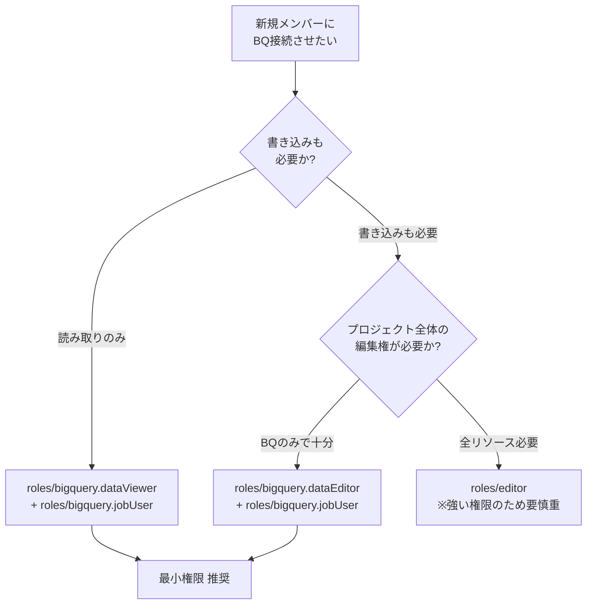

## 1. 概要

Google スプレッドシートの **データコネクタ（Connected Sheets）** 機能で、本プロジェクトの BigQuery
（GCP プロジェクト `monthly-pay-tax`、データセット `pay_reports` / `pay_reports_backup`）に
接続できる Google アカウント（個人ユーザー）の一覧と、接続の仕組み・追加手順をまとめる。

> **想定読者**: BQ にスプレッドシート経由で直接アクセスして集計・分析したい管理者・チェッカー。
> ダッシュボード（`pay-dashboard`）から閲覧する場合は本ドキュメントの権限とは別系統（OIDC + `dashboard_users` ホワイトリスト）。

---

## 2. 現在 接続可能なアカウント（2026-06-06 時点）

GCP プロジェクト `monthly-pay-tax` の IAM ポリシーに基づく接続可能アカウント。

| メールアドレス | プロジェクト Role | データコネクタでできること |
|---|---|---|
| `yasushi-honda@tadakayo.jp` | `roles/owner` | 全権限（クエリ実行・データ書込・スキーマ変更すべて可） |
| `chiho-yoshizaki@tadakayo.jp` | `roles/editor` | クエリ実行 / データ書込 / VIEW 作成 可（スキーマ変更は不可） |
| `kenta-noguchi@tadakayo.jp` | `roles/editor` | 同上 |
| `mayumi-hanaeda@tadakayo.jp` | `roles/editor` | 同上 |
| `yuri-kondo@tadakayo.jp` | `roles/editor` | 同上 |

### 接続できるデータセット・テーブル

| データセット | 用途 | 主なテーブル |
|---|---|---|
| `pay_reports` | 本番データ | `gyomu_reports` / `hojo_reports` / `members` / `dashboard_users` / `check_logs` / `groups_master` / `reimbursement_items` / `wam_target_projects` / `member_master` / `dashboard_sync_groups` / `withholding_targets` |
| `pay_reports_backup` | Step0 snapshot（90日自動失効） | 上記5テーブルの日付付きスナップショット |
| `pay_reports`（VIEW） | データ加工レイヤー | `v_gyomu_enriched` / `v_hojo_enriched` / `v_monthly_compensation` / `v_reimbursement_enriched` |

---

## 3. 仕組み（なぜこの 5 名なのか）

### 3.1 データコネクタは「個人の Google アカウント」で OAuth 認証

スプレッドシートの「データ → データコネクタ → BigQuery に接続」を使うとき、
スプレッドシートを開いている **本人の Google アカウント** で OAuth 認証され、
そのアカウントが持つ BQ 権限の範囲でデータを取得する。

- サービスアカウント（`pay-collector@…`）は OAuth 認証できないため **データコネクタでは使えない**
- Cloud Run / GitHub Actions が使うキーレス認証とは別系統
- ダッシュボードのホワイトリスト（`dashboard_users` テーブル）とも別系統

### 3.2 IAM 権限と Connected Sheets の対応

データコネクタで BQ に接続するには最低限以下の権限が必要:

| 権限 | 用途 |
|---|---|
| `bigquery.jobs.create` | クエリの実行（プロジェクトレベル） |
| `bigquery.tables.getData` | テーブル/VIEW のデータ読み取り |
| `bigquery.tables.list` | テーブル一覧表示 |

これらは `roles/editor` や `roles/owner` に含まれる。最小権限で接続させたい場合は §5 参照。

### 3.3 現状の IAM 構造（プロジェクトレベル）

```mermaid
flowchart LR
  subgraph Owner[" roles/owner（全権限） "]
    O1[yasushi-honda@tadakayo.jp]
  end
  subgraph Editor[" roles/editor（書き込み可） "]
    E1[chiho-yoshizaki@tadakayo.jp]
    E2[kenta-noguchi@tadakayo.jp]
    E3[mayumi-hanaeda@tadakayo.jp]
    E4[yuri-kondo@tadakayo.jp]
  end
  subgraph SA[" Service Account（OAuth不可） "]
    SA1[pay-collector@... ]
  end
  Owner -->|BQ全権限| BQ[(BigQuery<br/>pay_reports<br/>pay_reports_backup)]
  Editor -->|データ読書| BQ
  SA -.->|Cloud Run経由のみ<br/>データコネクタは不可| BQ
```

---

## 4. 新規メンバーに接続させたい場合

### 4.1 判断フロー



### 4.2 推奨パターン: 最小権限（読み取りのみ）

```bash
# 例: example@tadakayo.jp に閲覧権限のみ付与
gcloud projects add-iam-policy-binding monthly-pay-tax \
  --member="user:example@tadakayo.jp" \
  --role="roles/bigquery.dataViewer"

gcloud projects add-iam-policy-binding monthly-pay-tax \
  --member="user:example@tadakayo.jp" \
  --role="roles/bigquery.jobUser"
```

- `dataViewer`: データセット内のテーブル・VIEW を SELECT 可
- `jobUser`: 自分名義のクエリジョブを起動可（課金は付与者プロジェクト）

### 4.3 書き込みも必要な場合

```bash
gcloud projects add-iam-policy-binding monthly-pay-tax \
  --member="user:example@tadakayo.jp" \
  --role="roles/bigquery.dataEditor"

gcloud projects add-iam-policy-binding monthly-pay-tax \
  --member="user:example@tadakayo.jp" \
  --role="roles/bigquery.jobUser"
```

### 4.4 確認コマンド

```bash
# 現在の IAM 一覧（BQ 関連のみ抽出）
gcloud projects get-iam-policy monthly-pay-tax --format=json | \
  python3 -c "import sys,json; \
  d=json.load(sys.stdin); \
  [print(b['role'], '→', ','.join(b['members'])) \
   for b in d['bindings'] \
   if 'bigquery' in b['role'].lower() or 'editor' in b['role'] or 'owner' in b['role']]"
```

---

## 5. 注意事項

### 5.1 セキュリティ

- 個人情報を含むテーブル（`member_master`, `reimbursement_items`, `dashboard_users` 等）への
  アクセス権付与は **「業務上の必要性」を確認**してから実施する
- `roles/editor` / `roles/owner` は BQ 以外（Cloud Run / Storage 等）の権限も付与されるため、
  BQ のみで十分な場合は `roles/bigquery.*` の最小権限を選ぶ
- 退職・異動時の権限剥奪は速やかに（`gcloud projects remove-iam-policy-binding`）

### 5.2 課金

- データコネクタで実行したクエリのスキャン量は **付与者プロジェクト（`monthly-pay-tax`）に課金**
- 大量データを頻繁にスキャンするとコスト増の要因。VIEW のフルスキャンに注意
- 月次のコスト確認: GCP コンソール → 課金 → レポート

### 5.3 データの一貫性

- データコネクタは「取得した時点のスナップショット」をスプレッドシートに保存する
- 毎朝6時のバッチ後（午前7時以降）の更新が推奨
- 「データ → 今すぐ更新」で最新データに更新可能

### 5.4 ダッシュボード との関係

データコネクタ接続権限は **ダッシュボード（pay-dashboard）のアクセス権とは独立**:

| 機能 | 認証 | 権限管理場所 |
|---|---|---|
| データコネクタ | Google OAuth（個人アカウント） | GCP プロジェクト IAM |
| ダッシュボード | Streamlit OIDC（個人アカウント） | BQ `pay_reports.dashboard_users` テーブル |

両方使わせたい場合は **両方に登録が必要**。

---

## 6. 関連ドキュメント

- `docs/operations/20260530_BQ_snapshot復旧手順.md` — snapshot バックアップの取得・復旧
- `CLAUDE.md` §「GCP環境」「BQスキーマ」 — テーブル定義一覧
- `infra/bigquery/schema.sql` — テーブルスキーマ定義（SQL）
- `infra/bigquery/views.sql` — VIEW 定義（SQL）
